# Webhook Relay

A secure and efficient system for relaying webhooks from external sources (like GitHub, GitLab) to internal services without exposing them to the public internet.

## Architecture

The system consists of two main components:

1. **Collector**: A publicly exposed service that receives webhooks from external sources and puts them on a message queue.
2. **Forwarder**: A service that runs alongside internal applications, reads messages from the queue, and forwards them to the internal service.

```mermaid
flowchart LR
    %% Define the nodes with clear, descriptive labels
    GitHub["GitHub\n(Webhook Source)"]
    Collector["Collector\n(Publicly Exposed)"]
    Queue["Message Queue\n(GCP/AWS)"]
    Forwarder1["Forwarder Sidecar\n(ArgoCD)"]
    Forwarder2["Forwarder Sidecar\n(Atlantis)"]
    ArgoCD["ArgoCD\n(GitOps Service)"]
    Atlantis["Atlantis\n(Terraform Service)"]
    
    %% Define the zones
    subgraph Public["Public Internet"]
        GitHub
    end
    
    subgraph DMZ["DMZ (Limited Exposure)"]
        Collector
        Queue
    end
    
    subgraph Private["Private Network"]
        Forwarder1
        Forwarder2
        ArgoCD
        Atlantis
    end
    
    %% Connect the components with numbered steps
    GitHub -->|"[1] Send webhook"| Collector
    Collector -->|"[2] Validate & queue"| Queue
    Queue -->|"[3a] Consume message"| Forwarder1
    Queue -->|"[3b] Consume message"| Forwarder2
    Forwarder1 -->|"[4a] Forward payload"| ArgoCD
    Forwarder2 -->|"[4b] Forward payload"| Atlantis
    
    %% Style the components
    classDef github fill:#24292e,color:#fff,stroke:#000,stroke-width:2
    classDef collector fill:#4285f4,color:#fff,stroke:#2a67c5,stroke-width:2
    classDef queue fill:#0f9d58,color:#fff,stroke:#0b7b45,stroke-width:2
    classDef forwarder fill:#db4437,color:#fff,stroke:#a53125,stroke-width:2
    classDef argocd fill:#f5ba21,color:#333,stroke:#c68f00,stroke-width:2
    classDef atlantis fill:#ab47bc,color:#fff,stroke:#7c3992,stroke-width:2
    classDef zone fill:#f8f9fa,stroke:#666,stroke-dasharray:5 5,stroke-width:2
    
    %% Apply styles
    class GitHub github
    class Collector collector
    class Queue queue
    class Forwarder1,Forwarder2 forwarder
    class ArgoCD argocd
    class Atlantis atlantis
    class Public,DMZ,Private zone
```



### Features

- **Security**: Only the collector service needs to be exposed to the internet, while internal services remain private.
- **Reliability**: Uses message queues to ensure webhook delivery even if downstream services are temporarily unavailable.
- **Scalability**: Multiple forwarders can consume messages from the same queue, enabling horizontal scaling.
- **Observability**: Both components expose Prometheus metrics for monitoring.
- **Flexibility**: Supports both Google Cloud Pub/Sub and AWS SQS as message queue backends.
- **Configuration**: Easy configuration through YAML files and environment variables using pydantic-settings.
- **Signature Verification**: Optional webhook signature verification for added security.

## Installation

### Prerequisites

- Python 3.8 or higher
- Access to either Google Cloud Pub/Sub or AWS SQS

### Install from PyPI

```bash
# Basic installation
pip install webhook-relay

# With GCP Pub/Sub support
pip install webhook-relay[gcp]

# With AWS SQS support
pip install webhook-relay[aws]

# With both queue providers
pip install webhook-relay[gcp,aws]
```

### Install from Source

```bash
git clone https://github.com/yourusername/webhook-relay.git
cd webhook-relay
pip install -e ".[all]"
```

## Configuration

### Collector Configuration

Create a YAML file for the collector configuration:

```yaml
host: "0.0.0.0"
port: 8000
log_level: "INFO"
queue_type: "gcp_pubsub"  # or "aws_sqs"

# GCP PubSub configuration (if queue_type is "gcp_pubsub")
gcp_config:
  project_id: "your-gcp-project-id"
  topic_id: "webhook-relay-topic"

# AWS SQS configuration (if queue_type is "aws_sqs")
# aws_config:
#   region_name: "us-west-2"
#   queue_url: "https://sqs.us-west-2.amazonaws.com/123456789012/webhook-relay-queue"

metrics:
  enabled: true
  port: 9090
  path: "/metrics"

webhook_sources:
  - name: "github"
    secret: "your-github-webhook-secret"  # Optional, for signature verification
    signature_header: "X-Hub-Signature-256"
  - name: "gitlab"
    secret: "your-gitlab-webhook-secret"
    signature_header: "X-Gitlab-Token"
  - name: "custom"  # A source without signature verification
```

### Forwarder Configuration

Create a YAML file for the forwarder configuration:

```yaml
log_level: "INFO"
queue_type: "gcp_pubsub"  # or "aws_sqs"

# Target URL to forward webhooks to
target_url: "http://your-internal-service:8080/webhook"

# Optional headers to include in forwarded requests
headers:
  X-Webhook-Relay: "true"
  Authorization: "Bearer your-internal-token"

# Retry configuration
retry_attempts: 3
retry_delay: 5  # seconds
timeout: 10  # seconds

# GCP PubSub configuration (if queue_type is "gcp_pubsub")
gcp_config:
  project_id: "your-gcp-project-id"
  topic_id: "webhook-relay-topic"
  subscription_id: "webhook-relay-subscription"  # Required for forwarder

# AWS SQS configuration (if queue_type is "aws_sqs")
# aws_config:
#   region_name: "us-west-2"
#   queue_url: "https://sqs.us-west-2.amazonaws.com/123456789012/webhook-relay-queue"

metrics:
  enabled: true
  port: 9091  # Different from collector to avoid port conflicts
  path: "/metrics"
```

### Environment Variables

All configuration options can be set using environment variables. The prefix `WEBHOOK_RELAY_` is used for all variables, and nested fields use double underscores (`__`):

```bash
# Basic configuration
export WEBHOOK_RELAY_LOG_LEVEL=INFO
export WEBHOOK_RELAY_QUEUE_TYPE=gcp_pubsub

# GCP configuration
export WEBHOOK_RELAY_GCP_CONFIG__PROJECT_ID=your-gcp-project-id
export WEBHOOK_RELAY_GCP_CONFIG__TOPIC_ID=webhook-relay-topic
export WEBHOOK_RELAY_GCP_CONFIG__SUBSCRIPTION_ID=webhook-relay-subscription

# Collector-specific
export WEBHOOK_RELAY_HOST=0.0.0.0
export WEBHOOK_RELAY_PORT=8000

# Forwarder-specific
export WEBHOOK_RELAY_TARGET_URL=http://your-internal-service:8080/webhook
export WEBHOOK_RELAY_RETRY_ATTEMPTS=3
```

## Usage

### Running the Collector

```bash
# Using the CLI
webhook-relay-collector serve --config path/to/collector_config.yaml

# Using Python
python -m webhook_relay.collector.app serve --config path/to/collector_config.yaml
```

### Running the Forwarder

```bash
# Using the CLI
webhook-relay-forwarder serve --config path/to/forwarder_config.yaml

# Using Python
python -m webhook_relay.forwarder.app serve --config path/to/forwarder_config.yaml
```

## Kubernetes Deployment

### Collector Deployment

```yaml
apiVersion: apps/v1
kind: Deployment
metadata:
  name: webhook-relay-collector
  namespace: webhook-relay
spec:
  replicas: 2
  selector:
    matchLabels:
      app: webhook-relay-collector
  template:
    metadata:
      labels:
        app: webhook-relay-collector
    spec:
      containers:
      - name: collector
        image: your-registry/webhook-relay:latest
        command: ["webhook-relay-collector", "serve", "--config", "/etc/webhook-relay/config.yaml"]
        ports:
        - containerPort: 8000
          name: http
        - containerPort: 9090
          name: metrics
        volumeMounts:
        - name: config
          mountPath: /etc/webhook-relay
      volumes:
      - name: config
        configMap:
          name: webhook-relay-collector-config
---
apiVersion: v1
kind: Service
metadata:
  name: webhook-relay-collector
  namespace: webhook-relay
spec:
  type: ClusterIP
  ports:
  - port: 8000
    targetPort: http
    name: http
  - port: 9090
    targetPort: metrics
    name: metrics
  selector:
    app: webhook-relay-collector
```

### Forwarder as a Sidecar

```yaml
apiVersion: apps/v1
kind: Deployment
metadata:
  name: your-internal-service
  namespace: your-namespace
spec:
  replicas: 1
  selector:
    matchLabels:
      app: your-internal-service
  template:
    metadata:
      labels:
        app: your-internal-service
    spec:
      containers:
      - name: main-app
        image: your-registry/your-internal-service:latest
        ports:
        - containerPort: 8080
      - name: webhook-relay-forwarder
        image: your-registry/webhook-relay:latest
        command: ["webhook-relay-forwarder", "serve", "--config", "/etc/webhook-relay/config.yaml"]
        ports:
        - containerPort: 9091
          name: metrics
        volumeMounts:
        - name: config
          mountPath: /etc/webhook-relay
      volumes:
      - name: config
        configMap:
          name: webhook-relay-forwarder-config
```

## Development

```bash
# Clone repository
git clone https://github.com/yourusername/webhook-relay.git
cd webhook-relay

# Set up virtual environment
python -m venv venv
source venv/bin/activate  # On Windows: venv\Scripts\activate

# Install in development mode with all extras
pip install -e ".[all]"

# Run tests
pytest

# Format code
black src tests
isort src tests

# Type checking
mypy src
```

## Metrics

The following Prometheus metrics are exposed:

### Collector Metrics

- `webhook_relay_received_total`: Total number of webhooks received (labels: `source`)
- `webhook_relay_processing_seconds`: Time spent processing webhooks (labels: `source`)
- `webhook_relay_queue_publish_total`: Total number of messages published to queue (labels: `queue_type`)
- `webhook_relay_queue_publish_errors`: Total number of errors publishing to queue (labels: `queue_type`)
- `webhook_relay_up`: Whether the webhook relay service is up (labels: `component=collector`)

### Forwarder Metrics

- `webhook_relay_queue_receive_total`: Total number of messages received from queue (labels: `queue_type`)
- `webhook_relay_queue_delete_total`: Total number of messages deleted from queue (labels: `queue_type`)
- `webhook_relay_forward_total`: Total number of webhooks forwarded (labels: `target`)
- `webhook_relay_forward_errors`: Total number of errors forwarding webhooks (labels: `target`, `status_code`)
- `webhook_relay_forward_retry_total`: Total number of webhook forward retries (labels: `target`)
- `webhook_relay_forward_seconds`: Time spent forwarding webhooks (labels: `target`)
- `webhook_relay_up`: Whether the webhook relay service is up (labels: `component=forwarder`)

## License

This project is licensed under the MIT License - see the LICENSE file for details.
